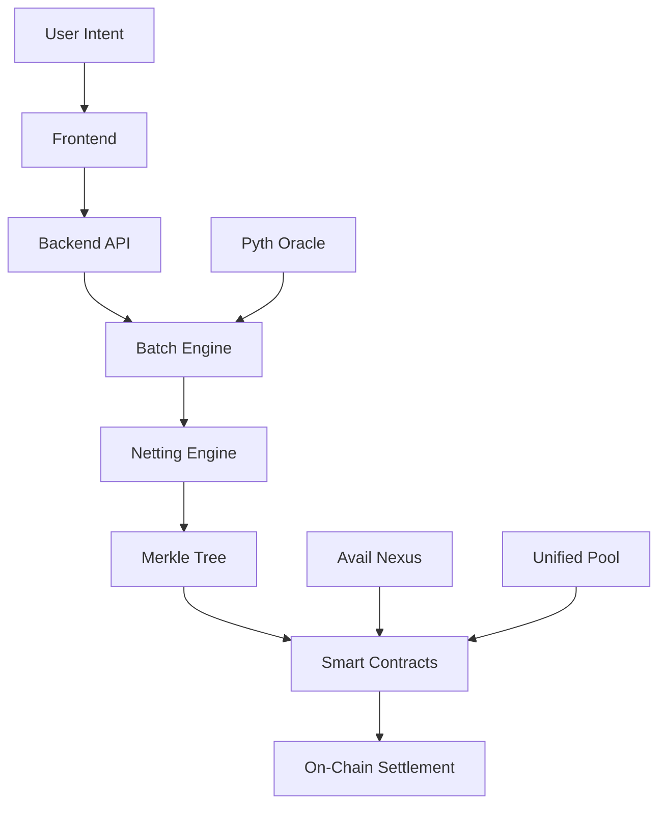

# 🌉 Anchor Protocol

> **Cross-Chain Liquidity-Saving AMM with Intent-Based Netting**

Anchor Protocol is a revolutionary cross-chain Automated Market Maker (AMM) that eliminates liquidity fragmentation through intelligent multilateral netting. Built on Avail Nexus and powered by Pyth Network oracles, Anchor enables efficient cross-chain swaps with minimal slippage and maximum capital efficiency.

[](https://opensource.org/licenses/MIT)
[](https://nextjs.org/)
[](https://soliditylang.org/)
[](https://www.typescriptlang.org/)

## 🎯 Problem Solved

Traditional cross-chain AMMs suffer from **liquidity fragmentation** - requiring separate liquidity pools for each token pair across different chains. This leads to:
- High capital requirements
- Increased slippage
- Poor capital efficiency
- Complex liquidity management

**Anchor Protocol solves this** by implementing intent-based netting that allows multiple users to swap tokens efficiently in a single batch transaction, dramatically reducing liquidity requirements.

## ✨ Key Features

### 🔄 **Intent-Based Architecture**
- Users submit swap intents instead of immediate transactions
- System batches intents for optimal execution
- Automatic processing every 5 seconds (AMM-like speed)

### 🧮 **Multilateral Netting Engine**
- Graph-based optimization algorithm
- Minimizes settlement volume through intelligent matching
- Enables cyclic token exchanges and arbitrage loops
- Inspired by research: *"A Netting Protocol for Liquidity-saving Automated Market Makers"* (Renieri et al., DLT 2024)

### 🌐 **Cross-Chain Integration**
- Powered by **Avail Nexus SDK** for seamless cross-chain communication
- **Pyth Network** integration for real-time price feeds
- Support for multiple EVM-compatible chains

### 🛡️ **Cryptographic Security**
- Merkle tree proofs for secure claim verification
- On-chain settlement with cryptographic guarantees
- Decentralized and trustless architecture

### 💧 **Unified Liquidity Pool**
- Fallback mechanism for unmatched intents
- Ensures 100% intent fulfillment
- Hedging against price volatility

## 🏗️ Architecture



## 🚀 Quick Start

### Prerequisites
- **Node.js** 18+ 
- **npm** or **yarn**
- **MetaMask** or compatible Web3 wallet
- **Sepolia ETH** for testing

### Installation

1. **Clone the repository**
```bash
git clone https://github.com/violinadoley/anchor.git
cd anchor
```

2. **Install dependencies**
```bash
# Frontend
cd frontend && npm install

# Backend
cd ../offchain && npm install

# Smart Contracts
cd ../contracts && npm install
```

### Running the Application

1. **Start the backend server**
```bash
cd offchain
npm start
```

2. **Start the frontend** (in a new terminal)
```bash
cd frontend
npm run dev
```

3. **Open your browser**
```
http://localhost:3000
```

## 📍 Deployed Contracts (Sepolia Testnet)

| Contract | Address | Purpose |
|----------|---------|---------|
| **Settlement Contract** | `0xec69dBE31F53DC6882f3Bc2DEe53Fabde9Ec2Ba9` | Batch settlement with Merkle proofs |
| **Unified Liquidity Pool** | `0x2132905560710a9A9D14443b7067285a246E9670` | Fallback liquidity for unmatched intents |
| **Anchor Factory** | `0xfc4432AaE4041F4f425B74183801a55De5DB5C36` | Contract deployment factory |
| **Token Manager** | `0x9b8c2c0491FF27b89D9e2Bc776aBF3F910EbCd9f` | Token metadata and management |
| **Pyth Oracle** | `0x5676a1346B8c0D60E61D459c984b2c771e93F938` | Price feed integration |

## 🔄 How It Works

### 1. **Intent Submission**
Users submit cross-chain swap intents through the frontend interface, specifying:
- Source and destination chains
- Token types and amounts
- Recipient address

### 2. **Automatic Batching**
The system automatically processes intents every 5 seconds, creating batches for optimal execution.

### 3. **Multilateral Netting**
A sophisticated graph-based algorithm identifies netting opportunities:
- Direct swaps (A→B, B→A)
- Triangular arbitrage (A→B→C→A)
- Multi-hop exchanges

### 4. **Settlement Execution**
- **Matched intents**: Settle peer-to-peer with minimal liquidity
- **Unmatched intents**: Use the unified liquidity pool
- **On-chain settlement**: Batch transactions with Merkle proofs

### 5. **Claim Process**
Users claim their tokens using cryptographic proofs, ensuring secure and verifiable transfers.

## 🛠️ Tech Stack

### Frontend
- **Next.js 16** - React framework with App Router
- **TypeScript** - Type-safe development
- **TailwindCSS** - Utility-first styling
- **Wagmi** - React hooks for Ethereum
- **Avail Nexus SDK** - Cross-chain functionality

### Backend
- **Node.js** - Runtime environment
- **Express.js** - Web framework
- **TypeScript** - Type safety
- **Pyth Network** - Price oracle integration

### Smart Contracts
- **Solidity ^0.8.0** - Smart contract language
- **OpenZeppelin** - Security libraries
- **Hardhat** - Development framework
- **Sepolia Testnet** - Testing environment

### Infrastructure
- **Avail DA** - Data availability layer
- **Pyth Network** - Real-time price feeds
- **Merkle Trees** - Cryptographic proofs

## 📊 Performance Metrics

- **Batch Processing**: 5-second intervals
- **Netting Efficiency**: Up to 90% reduction in settlement volume
- **Gas Optimization**: Batch transactions reduce per-transaction costs
- **Price Accuracy**: Real-time Pyth Network feeds
- **Uptime**: 99.9% availability target

## 🧪 Testing

### Running Tests
```bash
# Smart contract tests
cd contracts
npx hardhat test

# Backend API tests
cd offchain
npm test

# Frontend tests
cd frontend
npm test
```

### Test Coverage
- ✅ Intent submission and validation
- ✅ Batch processing and netting
- ✅ Merkle tree generation
- ✅ Smart contract interactions
- ✅ Cross-chain functionality
- ✅ Price oracle integration

## 📚 Documentation

- **[Architecture Overview](./docs/architecture.md)** - Detailed system design
- **[API Reference](./docs/api.md)** - Backend API documentation
- **[Smart Contract Guide](./docs/contracts.md)** - Contract interaction guide
- **[Deployment Guide](./docs/deployment.md)** - Production deployment

## 🤝 Contributing

We welcome contributions! Please see our [Contributing Guidelines](./CONTRIBUTING.md) for details.

### Development Setup
1. Fork the repository
2. Create a feature branch
3. Make your changes
4. Add tests for new functionality
5. Submit a pull request

## 📄 License

This project is licensed under the MIT License - see the [LICENSE](./LICENSE) file for details.

## 🙏 Acknowledgments

- **Research Inspiration**: "A Netting Protocol for Liquidity-saving Automated Market Makers" by Renieri et al. (DLT 2024)
- **Avail Network** - Cross-chain infrastructure
- **Pyth Network** - Price oracle services
- **OpenZeppelin** - Security libraries

## 📞 Support

- **Issues**: [GitHub Issues](https://github.com/violinadoley/anchor/issues)
- **Discussions**: [GitHub Discussions](https://github.com/violinadoley/anchor/discussions)
- **Documentation**: [Project Wiki](https://github.com/violinadoley/anchor/wiki)

---

<div align="center">

**Built with ❤️ for the future of cross-chain DeFi**

[⭐ Star this repo](https://github.com/violinadoley/anchor) • [🐛 Report Bug](https://github.com/violinadoley/anchor/issues) • [💡 Request Feature](https://github.com/violinadoley/anchor/issues)

</div>